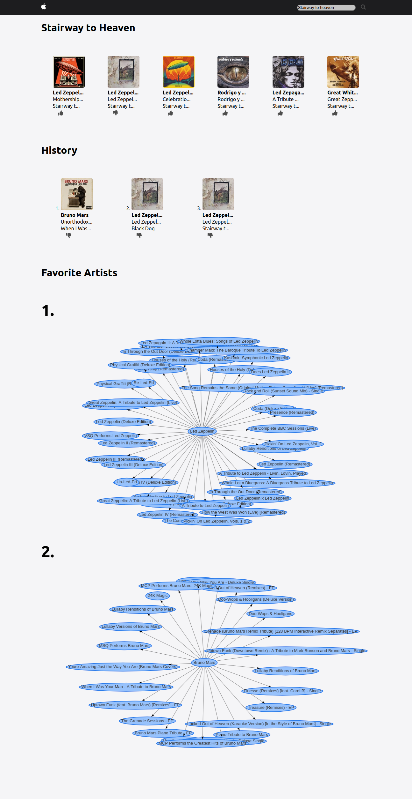

# iTunes-Search

> Front-end application to navigate within the iTunes Store that includes a Like feature that will allow the user to save the searched music and show the history of the saved songs in the order in which they liked them. A top 5 of the most liked artists will be displayed with a graph showing the artist name in the middle node and the albums published in the surrounding nodes.

## Built

- Javascript
- React
- Redux
- CSS
- Vis-Network

## Live Demo

[Live Demo](https://jarfsoft-itunes-search.netlify.app/)

## Getting Started

To get a local copy up and running follow these simple example steps.

### Prerequisites

- A browser
- Text Editor

### Setup

**STEP 1**
In the terminal, Run the following commands.

- `git clone https://github.com/Jarfsoft/jarfsoft-itunes-search`
- `cd jarfsoft-itunes-search`

OR

- Download the zip file form `https://github.com/Jarfsoft/jarfsoft-itunes-search`

**STEP 2**

- In the Terminal enter `cd jarfsoft-itunes-search`
- Run `npm install`
- Run `npm start`

## Author

👤 **Juan Andrés Raudales**

- GitHub: [@Jarfsoft](https://github.com/Jarfsoft)
- Twitter: [@Jarfsoft](https://twitter.com/Jarfsoft)
- LinkedIn: [Juan Andrés Raudales Flores](https://www.linkedin.com/in/juan-raudales-flores/)

## 🤝 Contributing

Contributions, issues and feature requests are welcome!

Feel free to check the [issues page](https://github.com/Jarfsoft/jarfsoft-itunes-search/issues).

## Show your support

Give a ⭐️ if you like this project!

## 📝 License

This project is [MIT](https://opensource.org/licenses/MIT) licensed.